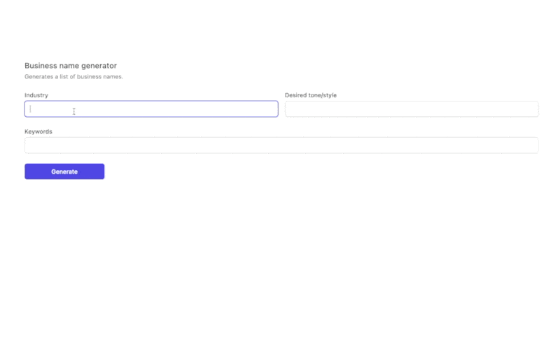

<p align="center">
  <h3 align="center">Business Name Generator</h3>

  <p align="center">
A web app that generates business names based on keywords, industry and tone.
    <br>
    </p>
</p>

<br>

## Table of contents

- [About the Website](#about-the-website)
- [Technical](#technical)
- [Licence](#license)
- [Versions](#versions)
- [Contact Information](#contact-information)

### About the website

This is a web app that generates business names based on keywords, industry and tone.

<p align="center">
  
</p>

### Technical

#### Technology Used

This project uses: sveltekit, tailwindcss, ai, openai, openai-edge

#### Running the project

Ensure that you have the openai api key in the `.env` file. This can be generated here https://platform.openai.com/account/api-keys

Install the project dependencies by running

```console
pnpm install
```

And then navigate to https://localhost:5173 to view the project (in case no other sveltekit project is running).

#### Step by step guide

1. Create a new sveltekit project https://kit.svelte.dev/

```console
pnpm create svelte@latest my-app
```

2. Install tailwind css to make designing easier https://tailwindcss.com/docs/guides/sveltekit

3. Install tailwind forms

```console
pnpm install @tailwindcss/forms
```

4. Install openai and ai

```console
pnpm install ai openai openai-edge
```

5. Ensure the openai key is in the `.env` file. This can be generated here https://platform.openai.com/account/api-keys

6. Design the website and the forms

```html
<main class="mt-32">
	<div class="px-4 pb-12 mx-auto max-w-7xl sm:px-6 lg:px-8">
		<form class="space-y-8 divide-y divide-gray-200" on:submit="{handleSubmit}">
			<div class="pt-8">
				<div>
					<h3 class="text-lg font-medium leading-6 text-gray-900">Business name generator</h3>
					<p class="mt-1 text-sm text-gray-500">Generates a list of business names.</p>
				</div>
				<div class="grid grid-cols-1 mt-6 gap-y-6 gap-x-4 sm:grid-cols-6">
					<div class="sm:col-span-3">
						<label for="industry" class="block text-sm font-medium text-gray-700"> Industry </label>
						<div class="mt-1">
							<input
								bind:value="{industry}"
								type="text"
								name="industry"
								id="industry"
								required
								class="block w-full border-gray-300 rounded-md shadow-sm focus:ring-indigo-500 focus:border-indigo-500 sm:text-sm"
							/>
						</div>
					</div>

					<div class="sm:col-span-3">
						<label for="tone" class="block text-sm font-medium text-gray-700">
							Desired tone/style
						</label>
						<div class="mt-1">
							<input
								bind:value="{tone}"
								id="tone"
								name="tone"
								type="text"
								required
								class="block w-full border-gray-300 rounded-md shadow-sm focus:ring-indigo-500 focus:border-indigo-500 sm:text-sm"
							/>
						</div>
					</div>
					<div class="sm:col-span-6">
						<label for="keywords" class="block text-sm font-medium text-gray-700"> Keywords </label>
						<div class="mt-1">
							<input
								bind:value="{keywords}"
								type="text"
								name="keywords"
								id="keywords"
								required
								class="block w-full border-gray-300 rounded-md shadow-sm focus:ring-indigo-500 focus:border-indigo-500 sm:text-sm"
							/>
						</div>
					</div>

					<button
						type="submit"
						disabled="{!isLoading}"
						class="inline-flex justify-center px-4 py-2 text-sm font-medium text-white bg-indigo-600 border border-transparent rounded-md shadow-sm hover:bg-indigo-700 focus:outline-none focus:ring-2 focus:ring-offset-2 focus:ring-indigo-500"
					>
						Generate
					</button>

					{#if $completion}
					<div class="sm:col-span-6">
						<label for="about" class="block text-sm font-medium text-gray-700"> Suggestions </label>
						<textarea
							id="suggestions"
							name="suggestions"
							rows="10"
							value="{$completion}"
							class="block w-full border border-gray-300 rounded-md shadow-sm focus:ring-indigo-500 focus:border-indigo-500 sm:text-sm"
						/>
					</div>
					{/if}
				</div>
			</div>
		</form>
	</div>
</main>
```

7. Create the script to handle the form submission

```html
<script>
	import { useCompletion } from 'ai/svelte';

	const { complete, isLoading, completion } = useCompletion();

	let keywords = '';
	let industry = '';
	let tone = '';

	function handleSubmit() {
		console.log('submitting');
		complete(
			JSON.stringify({
				keywords: keywords,
				industry: industry,
				tone: tone
			})
		);
	}
</script>
```

8. Create the backend server code on 'routes/api/completion/+server.js'

```js
import { Configuration, OpenAIApi } from 'openai-edge';
import { OpenAIStream, StreamingTextResponse } from 'ai';
import { OPENAI_API_KEY } from '$env/static/private';

const config = new Configuration({
	apiKey: OPENAI_API_KEY
});

const openai = new OpenAIApi(config);

export async function POST({ request }) {
	const { prompt } = await request.json();

	const { keywords, tone, industry } = JSON.parse(prompt);

	const payload = {
		model: 'gpt-3.5-turbo-0613',
		messages: [
			{
				role: 'user',
				content: `Given an industry, a set of keywords, and a tone, generate 10 business ideas for a company in the industry that are associated with the keywords and match the tone. 
                    The industry is ${industry}, the keywords are ${keywords}, and the tone is ${tone}. 
                    Each business idea should be a short sentence or phrase that describes the idea. `
			}
		],
		temperature: 0.9,
		stream: true
	};

	// Ask OpenAI for a streaming completion given the prompt
	const response = await openai.createChatCompletion(payload);

	// Convert the response into a friendly text-stream
	const stream = OpenAIStream(response);
	// Respond with the stream
	return new StreamingTextResponse(stream);
}
```

#### CONTRIBUTING

I would/ We'd love to have your help in making **business name generator** better. The project is still very incomplete, but if there's an issue you'd like to see addressed sooner rather than later, let me(/us) know.

Before you contribute though read the contributing guide here: [Contributing.md](https://github.com/peterokwara/business-name-generator/blob/master/CONTRIBUTING.md)

For any concerns, please open an [issue](https://github.com/peterokwara/business-name-generator/issues), or JUST, [fork the project and send a pull request](https://github.com/peterokwara/business-name-generator/pulls).

<hr>

### License

- see [LICENSE](https://github.com/peterokwara/business-name-generator/blob/master/LICENSE) file

### Versions

- Version 1.0 DATE 10/04/2022

### Contact Information

If you have found any bugs, or have any feedback or questions and or want to post a feature request please use the [Issuetracker](https://github.com/peterokwara/business-name-generator/issues) to report them.

<hr>

[](#)

<br>

[](https://github.com/peterokwara/business-name-generator/blob/master/LICENSE)
